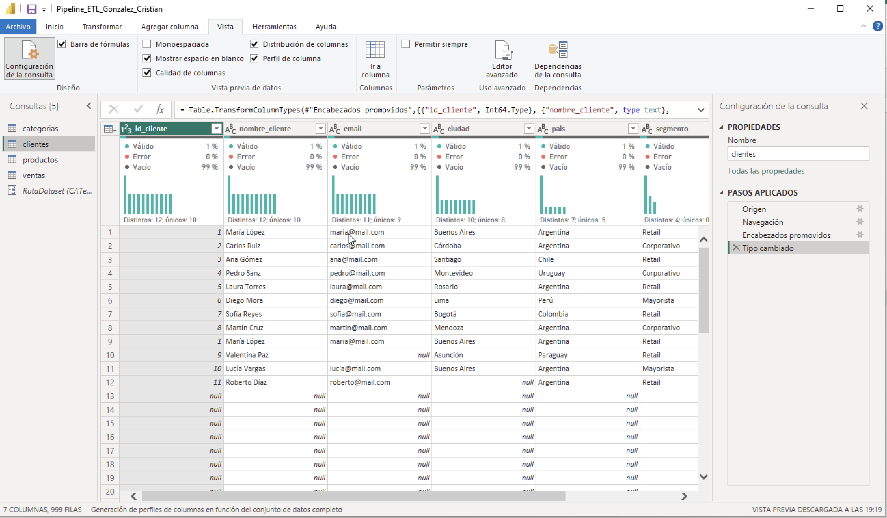
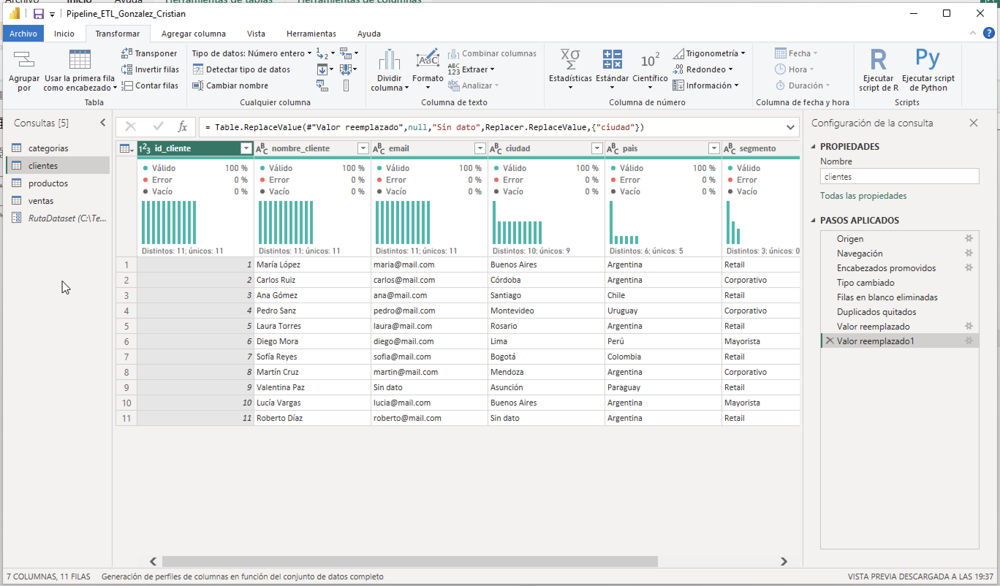
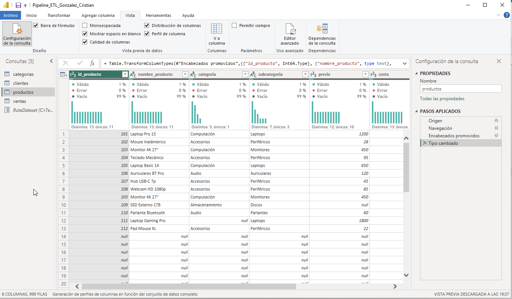
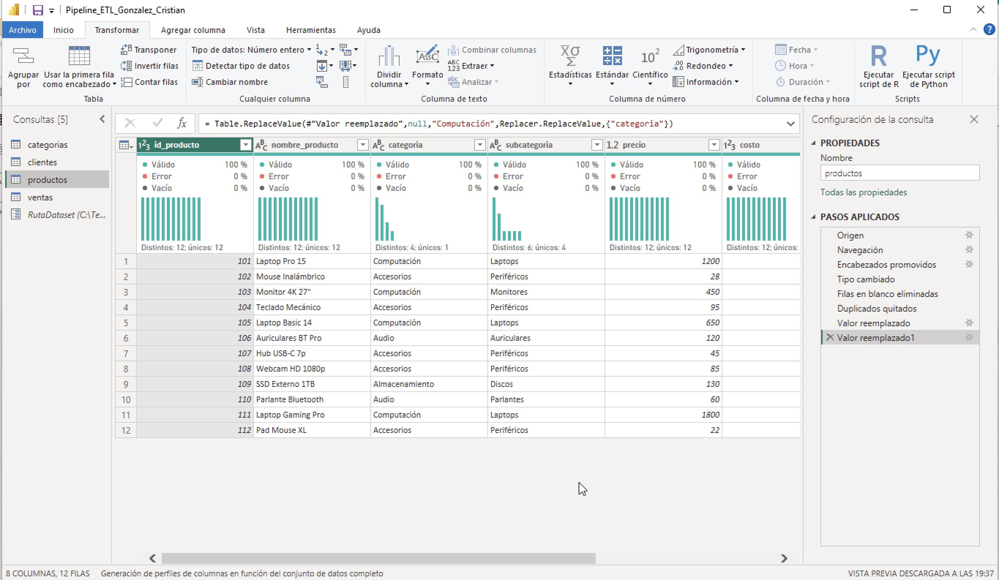
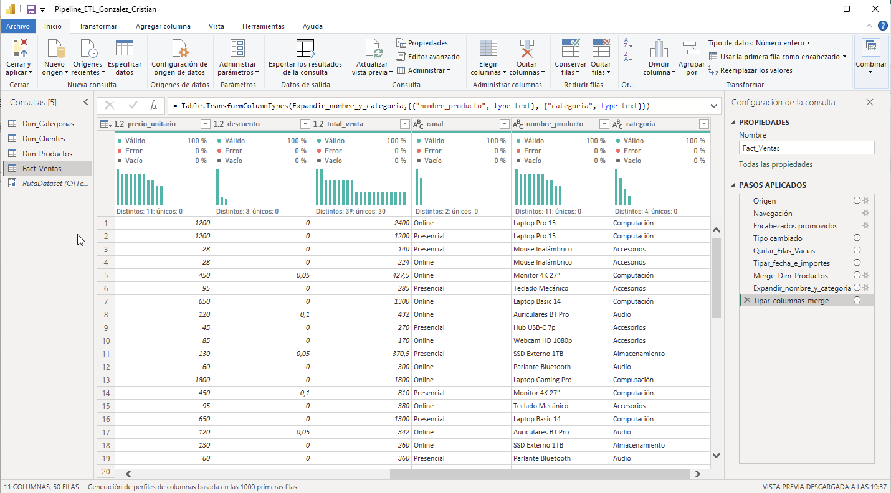
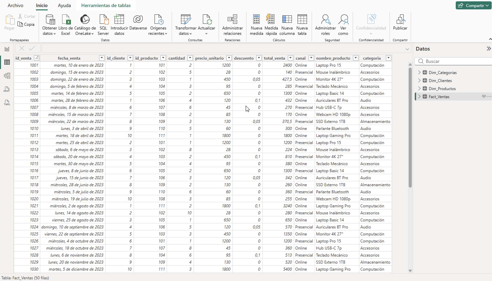

# M6 · Pipeline ETL: de datos crudos a modelo confiable en Power BI

**Autor:** Cristian González · **Curso:** Data Analytics – Coderhouse · **Contexto:** analista SSR en TechStore

## Entregable

| Archivo | Descripción |
|---|---|
| `Pipeline_ETL_Gonzalez_Cristian.pbix` | Modelo Power BI con las 4 consultas limpias, tipadas y documentadas en M |
| `*.png` | Evidencias del perfilado (antes / después), del Merge y de la verificación final |

**Fuente:** `Pipeline_ETL_Dataset.xlsx` (provisto por el curso). La ruta del archivo se parametrizó en Power Query (`RutaDataset`) para no depender de un path fijo: si el archivo cambia de ubicación se actualiza un único parámetro y las 4 consultas siguen funcionando.

## Resultado

| Consulta | Origen | Filas leídas | Filas finales | Transformaciones |
|---|---|---|---|---|
| `Dim_Clientes` | hoja `clientes` | 999 | **11** | filas vacías, 1 duplicado, 2 nulos, tipo de fecha |
| `Dim_Productos` | hoja `productos` | 999 | **12** | filas vacías, 1 duplicado, 2 nulos, importes a decimal |
| `Dim_Categorias` | hoja `categorias` | 999 | **4** | filas vacías |
| `Fact_Ventas` | hoja `ventas` | 999 | **50** | filas vacías, tipos de fecha e importes, Merge con `Dim_Productos` |

Las hojas `territorios` y `README` del Excel no se cargaron porque no forman parte del modelo pedido.

## Perfilado

Se activaron **Calidad de columnas**, **Distribución de columnas** y **Perfil de columna**, con la generación de perfiles sobre **todo el conjunto de datos** (no solo las primeras 1000 filas).

| Antes | Después |
|---|---|
|  |  |
|  |  |

## Justificación de decisiones

### 0. Filas vacías (hallazgo adicional del perfilado)
El archivo fue exportado desde Google Sheets y cada hoja arrastra filas vacías hasta la fila 1000: Power Query leía **999 filas** con 99% de vacíos. Se aplicó **Quitar filas en blanco** como primer paso de limpieza en las 4 consultas y **antes** de quitar duplicados, porque si no `Table.Distinct` conservaría una fila con ID nulo como si fuera un registro válido.

### 1. Duplicados (eliminados por la columna ID, no por todas las columnas)

| Tabla | Registro | Decisión | Justificación |
|---|---|---|---|
| clientes | `id_cliente = 1` (María López), cargado 2 veces | Quitar duplicados sobre `id_cliente` | Las 2 filas son idénticas en las 7 columnas: conservar la primera no pierde información. La dimensión necesita un ID único para ser el lado "1" de la relación 1:N con `Fact_Ventas` (M8). |
| productos | `id_producto = 103` (Monitor 4K 27"), cargado 2 veces | Quitar duplicados sobre `id_producto` | Filas idénticas en las 8 columnas. Si no se deduplica, el Merge duplicaría sus 5 ventas y `Fact_Ventas` pasaría de 50 a 55 filas. |

### 2. Nulos (resueltos por reemplazo, sin eliminar filas)

| Tabla | Registro | Columna | Decisión | Justificación |
|---|---|---|---|---|
| clientes | `id_cliente = 9` (Valentina Paz) | `email` | `"Sin dato"` | Tiene 5 ventas (1010, 1019, 1029, 1039, 1049); eliminarla dejaría ventas huérfanas. No se inventa un email para no falsear datos de contacto. |
| clientes | `id_cliente = 11` (Roberto Díaz) | `ciudad` | `"Sin dato"` | No se puede deducir: el dataset tiene 4 ciudades argentinas posibles. El país está completo, así que el registro sigue siendo útil para analizar por país. |
| productos | `id_producto = 109` (SSD Externo 1TB) | `precio` | `130` | Campo crítico. Es el `precio_unitario` registrado en sus 5 ventas (1009, 1018, 1029, 1038, 1047): el valor sale del propio sistema de ventas, no es una estimación. Coherente con su costo (75). |
| productos | `id_producto = 111` (Laptop Gaming Pro) | `categoria` | `"Computación"` | Su subcategoría es "Laptops", igual que 101 y 105 (ambos Computación), y `Dim_Categorias` describe Computación como "Laptops, PCs y monitores". Se prefirió sobre "Sin categoría" porque la evidencia es concluyente. |

**Observación:** el producto `112` (Pad Mouse XL) tiene `stock = 0` y `activo = 0` y no registra ventas. **No es un error de calidad:** es un producto dado de baja y se conserva.

## Transformaciones

**Tipos de dato**
- IDs, `cantidad`, `stock` y `activo` → Número entero.
- `precio`, `costo`, `precio_unitario`, `descuento` y `total_venta` → Número decimal (importes; `descuento` tiene valores 0,05 y 0,1).
- `fecha_venta` y `fecha_registro` → Fecha. Venían como número de serie de Excel (ej. 44936 = 10/01/2023) y sin este cambio la línea de tiempo de M7 no funcionaría.
- Nombres, categorías, `canal` y `email` → Texto. Ninguna columna queda como tipo "any".

**Nomenclatura:** `clientes` → `Dim_Clientes`, `productos` → `Dim_Productos`, `categorias` → `Dim_Categorias`, `ventas` → `Fact_Ventas`. Las columnas ya venían en español y en snake_case, así que no fue necesario renombrarlas. Los pasos de Power Query se renombraron con nombres descriptivos (ej. `Quitar_Duplicados_id_producto`, `Reemplazar_Nulo_precio`).

**Merge:** desde `Fact_Ventas` → Combinar consultas (sobre la misma consulta, no "como nueva") con `Dim_Productos` por `id_producto`, unión **externa izquierda**. Coincidieron 50 de 50 filas. Se expandieron solo `nombre_producto` y `categoria`, sin prefijo.

## Documentación en lenguaje M
Las consultas `Dim_Productos`, `Dim_Clientes` y `Fact_Ventas` tienen comentarios `//` en el Editor Avanzado que explican el razonamiento de cada paso: por qué se deduplica por ID, de dónde sale cada valor de reemplazo, por qué se tipa cada columna y de qué depende el Merge.

## Verificación final
- Ninguna consulta con errores ni triángulo amarillo.
- Conteos: **Dim_Clientes 11 · Dim_Productos 12 · Dim_Categorias 4 · Fact_Ventas 50**.
- Cerrar y aplicar sin errores de carga.

